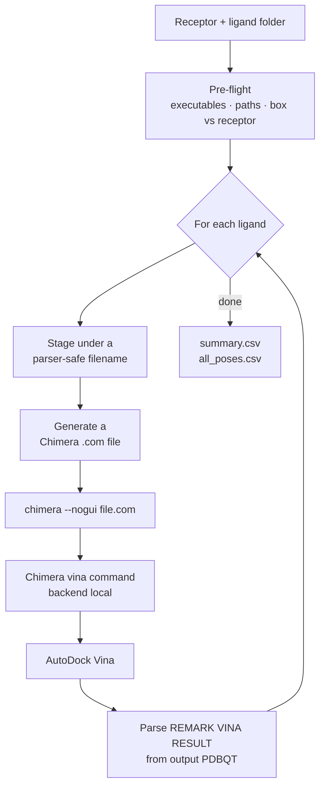

<div align="center">

# 🧬 DockMate

### Batch molecular docking, automated — UCSF Chimera + AutoDock Vina

*One receptor. Every ligand in a folder. One ranked table out.*

[](https://www.python.org/)
[](https://www.cgl.ucsf.edu/chimera/)
[](https://vina.scripps.edu/)
[](LICENSE)
[](#-requirements)

[](#-requirements)
[]()
[](#-contributing)

</div>

---

## 📖 What is this?

Docking one ligand through the UCSF Chimera GUI is easy. Docking **forty** is an
afternoon of clicking, and a single mistyped coordinate silently ruins the whole
set.

**DockMate** turns that into one command. Point it at a prepared receptor and a
folder of ligands; it drives Chimera's built-in `vina` command headlessly, one
ligand at a time, and hands you a ranked CSV of binding affinities.

```console
$ python dockmate.py

[1/12] ligand_001_minimized.mol2
    best    -6.80 kcal/mol   9 modes   34s
[2/12] ligand_002_minimized.mol2
    best    -7.20 kcal/mol   9 modes   96s
...

  12/12 ligands with results   (24.6 min total)
  ranked summary : .../vina_out/summary.csv
```

---

## ✨ Why not just run Vina directly?

You can — and for very large screens you probably should. DockMate exists for
the common middle ground where you want **Chimera's structure preparation and
ViewDock analysis** but not its click-through workflow. It reuses the exact
`vina` command Chimera exposes, so results are identical to what you would get
by hand, and every generated command file is kept for inspection.

What it adds on top:

| | |
|---|---|
| 🧭 **Box validation** | Tells you whether your search box is actually *on* the protein, before you burn hours on it |
| 🏷️ **Filename sanitising** | Ligand names with spaces, commas or brackets break Chimera's parser — handled automatically |
| ♻️ **Resumable** | Interrupted run? Re-run it. Completed ligands are skipped |
| 🛡️ **Isolated failures** | One Chimera process per ligand, so ligand 7 failing doesn't kill 8–40 |
| 📊 **Ranked output** | `summary.csv` sorted by affinity, plus `all_poses.csv` with every mode |
| 📏 **Size warnings** | Flags ligands too large to rotate freely inside your box |

---

## ⚠️ Read this first — the thing that breaks everyone

Chimera's `vina` command was originally built to submit jobs to a **web service
hosted by the NBCR, which was retired on 30 April 2020.** With default settings
the command simply fails.

DockMate always passes `backend local` together with an explicit `location`
pointing at your own Vina executable. **You must install AutoDock Vina locally**
— see [Requirements](#-requirements).

---

## 🔧 Requirements

| Requirement | Notes |
|---|---|
| **Python ≥ 3.8** | Standard library only — **no `pip install` needed** |
| **UCSF Chimera 1.19** | [Download](https://www.cgl.ucsf.edu/chimera/download.html) · free for non-commercial use |
| **AutoDock Vina** | [Download](https://vina.scripps.edu/downloads/) · must be installed **locally** |
| **A prepared receptor** | Hydrogens added, charges assigned — see [Preparing your receptor](#-preparing-your-receptor) |
| **Prepared ligands** | Energy-minimised, in a single folder |

> [!IMPORTANT]
> **The Vina executable path must contain no spaces.** Chimera's command parser
> splits arguments on whitespace and will mangle it.
>
> On Windows the installer puts it in
> `C:\Program Files (x86)\The Scripps Research Institute\Vina\` — copy it out:
> ```console
> mkdir C:\vina
> copy "C:\Program Files (x86)\The Scripps Research Institute\Vina\vina.exe" C:\vina\
> ```

---

## 🚀 Installation

```bash
git clone https://github.com/Vishu1197/DockMate.git
cd DockMate
```

That's it. There is nothing to build and nothing to install.

---

## ⚙️ Configuration — the only part you edit

Open `dockmate.py`. Everything you need is in the `CONFIG` block at the top.
**Edit it in place** — the imports above it are what make the file run.

```python
# --- 1. WHERE YOUR FILES ARE -------------------------------------------------
BASE_DIR   = Path(r"C:\path\to\your\project\MYTARGET")
RECEPTOR   = "MYTARGET_prepared.mol2"
LIGAND_DIR = None            # None -> same folder as BASE_DIR
LIGAND_GLOB = "*.mol2"
EXCLUDE     = []

# --- 2. THE SEARCH BOX -------------------------------------------------------
CENTER = None                # REQUIRED: (x, y, z) — see below
SIZE   = (25.0, 25.0, 25.0)

# --- 3. VINA SAMPLING --------------------------------------------------------
EXHAUSTIVENESS = 8
NUM_MODES      = 9
ENERGY_RANGE   = 3.0

# --- 4. RECEPTOR STATE -------------------------------------------------------
RECEPTOR_HAS_HYDROGENS = True

# --- 5. EXECUTABLES ----------------------------------------------------------
CHIMERA_EXE = Path(r"C:\Program Files\Chimera 1.19\bin\chimera.exe")
VINA_EXE    = Path(r"C:\vina\vina.exe")

# --- 6. RUN CONTROL ----------------------------------------------------------
OUT_DIR       = None         # None -> BASE_DIR / "vina_out"
TIMEOUT_MIN   = 60
SKIP_EXISTING = True
```

### Full reference

| Setting | What it does | Typical value |
|---|---|---|
| `BASE_DIR` | Folder holding the prepared receptor | `Path(r"C:\work\MYTARGET")` |
| `RECEPTOR` | Receptor filename inside `BASE_DIR` | `"MYTARGET_prepared.mol2"` |
| `LIGAND_DIR` | Folder of ligands; `None` = same as `BASE_DIR` | `None` |
| `LIGAND_GLOB` | Which files are ligands | `"*.mol2"` |
| `EXCLUDE` | Extra filenames to skip | `["decoy.mol2"]` |
| `CENTER` | **Required.** Box centre, receptor coordinates | `(19.71, -12.60, 1.50)` |
| `SIZE` | Box dimensions in Å | `(25.0, 25.0, 25.0)` |
| `EXHAUSTIVENESS` | Search thoroughness; 8 is Vina's default | `8` → `16–32` for publication |
| `NUM_MODES` | Binding modes reported per ligand | `9` |
| `ENERGY_RANGE` | Discard modes worse than this (kcal/mol) | `3.0` |
| `RECEPTOR_HAS_HYDROGENS` | `True` skips re-protonation (`r_addh false`) | `True` |
| `CHIMERA_EXE` | Path to the Chimera executable | see below |
| `VINA_EXE` | Path to `vina` / `vina.exe` — **no spaces** | `Path(r"C:\vina\vina.exe")` |
| `OUT_DIR` | Output folder; `None` = `BASE_DIR/vina_out` | `None` |
| `TIMEOUT_MIN` | Per-ligand wall-clock limit | `60` |
| `SKIP_EXISTING` | Resume instead of redoing finished ligands | `True` |

### Platform paths

<table>
<tr><th>OS</th><th>Chimera</th><th>Vina</th></tr>
<tr>
<td><b>Windows</b></td>
<td><code>Path(r"C:\Program Files\Chimera 1.19\bin\chimera.exe")</code></td>
<td><code>Path(r"C:\vina\vina.exe")</code></td>
</tr>
<tr>
<td><b>Linux</b></td>
<td><code>Path("/usr/local/chimera/bin/chimera")</code></td>
<td><code>Path("/usr/local/bin/vina")</code></td>
</tr>
<tr>
<td><b>macOS</b></td>
<td><code>Path("/Applications/Chimera.app/Contents/MacOS/chimera")</code></td>
<td><code>Path("/usr/local/bin/vina")</code></td>
</tr>
</table>

> On Windows, always use raw strings — `Path(r"C:\...")`. Without the `r`,
> `\t` and `\n` in a path become tab and newline characters.

---

## 🎯 Finding your box centre

`CENTER` has **no default and cannot be guessed.** It is different for every
structure, and a centre copied from another target will happily dock into empty
solvent and return plausible-looking scores.

Pick whichever applies:

<details>
<summary><b>① From a co-crystallised ligand</b> — best option when available</summary>

<br>

The original PDB entry usually contains the native ligand. Open it in Chimera,
select that ligand, and read off its centre:

```
open 1abc
select :LIG
Tools ▸ Structure Analysis ▸ Axes/Planes/Centroids ▸ Define centroid
```

Or from the command line, which reports the centroid in the Reply Log:

```
define centroid sel
```

Use those coordinates. **Your prepared receptor must be in the same coordinate
frame as the PDB you took them from** — if you did not re-orient anything during
preparation, it is.

</details>

<details>
<summary><b>② From known active-site residues</b></summary>

<br>

If the literature names the catalytic or binding residues:

```
select :195,57,102
define centroid sel
```

</details>

<details>
<summary><b>③ From a pocket-detection tool</b></summary>

<br>

[CASTp](http://sts.bioe.uic.edu/castp/), fpocket, or Chimera's own
`Tools ▸ Binding Analysis` will each propose pockets and report their centres.

</details>

<details>
<summary><b>④ Blind docking</b> — last resort</summary>

<br>

Enclose the whole protein. Run `--check-box` to see the receptor's bounding box,
then set `CENTER` to its middle and `SIZE` large enough to cover it.

Be aware this is a much harder search: raise `EXHAUSTIVENESS` to 32 or more,
expect long runtimes, and treat the rankings with caution.

</details>

### Then always verify it

```bash
python dockmate.py --check-box
```

```console
  receptor heavy atoms      : 3447
  receptor bbox X           :    -10.71 ..     46.59
  receptor bbox Y           :    -54.47 ..     18.46
  receptor bbox Z           :    -26.16 ..     33.52
  box spans   X             :      7.21 ..     32.21
  box spans   Y             :    -25.10 ..     -0.10
  box spans   Z             :    -11.00 ..     14.00
  box inside receptor bbox  : True
  heavy atoms inside box    : 661
  nearest heavy atom        : 4.11 A
  heavy atoms within  3 A   : 0
  heavy atoms within  5 A   : 8
  heavy atoms within  8 A   : 91
  residues lining site <=8A : ALA ARG ASP CYS GLN GLY HIS ILE LEU LYS PRO SER THR TYR VAL

  Box looks reasonable: on the protein, centre in open space.
```

**How to read it:**

| Signal | Meaning |
|---|---|
| `heavy atoms inside box` ≈ 0 | ❌ Box is not on the protein — wrong centre |
| `heavy atoms inside box` < 50 | ⚠️ Grazing the surface — probably wrong |
| `nearest heavy atom` < 2 Å | ⚠️ Centre is buried *inside* an atom, not in a cavity |
| `heavy atoms within 3 A` = 0 | ✅ Centre sits in open space — the signature of a real pocket |
| A few hundred atoms enclosed | ✅ Sampling a pocket-sized region |

---

## 🧪 Preparing your receptor

DockMate does not prepare structures — it docks them. Before running, use
Chimera's **Dock Prep** (`Tools ▸ Structure Editing ▸ Dock Prep`) to:

1. Delete water and unwanted heteroatoms
2. Repair truncated side chains
3. Replace MSE with MET, resolve alternate locations
4. Add hydrogens
5. Assign charges (AMBER ff14SB for standard residues)

Save the result as mol2. Then set `RECEPTOR_HAS_HYDROGENS = True`.

If you skip preparation, set it to `False` and Chimera will protonate on the
fly — but repairing side chains and removing waters is still on you.

---

## ▶️ Usage

```bash
python dockmate.py --check-box     # verify the box, dock nothing
python dockmate.py --dry-run       # list ligands found, run nothing
python dockmate.py                 # run the screen
python dockmate.py --only NAME     # one ligand (substring match)
python dockmate.py --force         # re-dock ligands that already have results
python dockmate.py --help          # usage
```

### Recommended first run

```bash
python dockmate.py --check-box          # 1. is the box on the pocket?
python dockmate.py --dry-run            # 2. are the right ligands found?
python dockmate.py --only <small_lig>   # 3. does one full run work end to end?
python dockmate.py                      # 4. go
```

Step 3 costs a minute and catches configuration mistakes before you commit to
the whole set. Step 4 skips the ligand from step 3 automatically.

---

## 📂 Output

```
vina_out/
├── summary.csv              ← ranked: one row per ligand, best affinity
├── all_poses.csv            ← every mode: affinity, rmsd_lb, rmsd_ub
├── <ligand>                 ← docked poses (PDBQT) — open in ViewDock
├── <ligand>.conf            ← Vina config, re-runnable standalone
├── <ligand>.receptor.pdbqt
├── <ligand>.ligand.pdbqt
├── _com/                    ← generated Chimera command files
├── _logs/                   ← per-ligand Chimera output
└── _ligands_clean/          ← sanitised ligand copies (originals untouched)
```

**`summary.csv`**

| ligand | safe_name | status | best_affinity_kcal_mol | n_modes | seconds |
|---|---|---|---|---|---|
| ligand_007_minimized.mol2 | ligand_007_minimized | ok | -8.4 | 9 | 412.7 |
| ligand_003_minimized.mol2 | ligand_003_minimized | ok | -7.9 | 9 | 233.1 |
| ligand_002_minimized.mol2 | ligand_002_minimized | ok | -7.2 | 9 | 96.4 |

Inspect any result in Chimera:

```
open vina_out/<ligand>
```

ViewDock opens automatically with all modes listed.

---

## 🔬 How it works



Each generated command file is exactly what you would type by hand:

```
close session
open 0 C:/path/to/receptor_prepared.mol2
open 1 C:/path/to/vina_out/_ligands_clean/myligand.mol2
vina docking receptor #0 ligand #1 output C:/path/to/vina_out/myligand search_center 19.7122,-12.5993,1.5019 search_size 25.0,25.0,25.0 exhaustiveness 8 num_modes 9 energy_range 3.0 r_addh false backend local location C:/vina/vina.exe wait true
stop confirmed
```

### Design decisions

**One Chimera process per ligand.** Costs a few seconds of startup each, but a
crash on ligand 7 cannot take out 8–40, and every ligand gets its own log.

**Success is judged by the output file, not the exit code.** Chimera can exit
`0` having produced nothing, so DockMate parses the result PDBQT for
`REMARK VINA RESULT` and only reports `ok` if poses came back.

**Ligands are staged, never modified.** Sanitised copies go to
`_ligands_clean/`; your originals are read-only inputs throughout.

---

## 🩺 Troubleshooting

<details>
<summary><b><code>NameError: name 'Path' is not defined</code></b></summary>

<br>

You copied only the `CONFIG` block into a new file. `Path` comes from
`from pathlib import Path`, which lives above it. Edit `dockmate.py` **in
place** rather than copying the config out.

</details>

<details>
<summary><b>Every ligand reports <code>FAILED</code></b></summary>

<br>

Open any file in `vina_out/_logs/`. The usual causes:

- **Vina not found / wrong path** → check `VINA_EXE`
- **Spaces in the Vina path** → copy `vina.exe` to `C:\vina\`
- **Chimera trying the retired web service** → make sure `backend local` is
  reaching Chimera; DockMate always sends it, so this means `VINA_EXE` is wrong

Then try the generated config directly, bypassing Chimera:

```bash
vina --config vina_out/<ligand>.conf
```

</details>

<details>
<summary><b>Scores look plausible but poses are in empty space</b></summary>

<br>

Almost always a wrong `CENTER` — often one copied from a different structure.
Different PDB entries have completely different coordinate frames.

```bash
python dockmate.py --check-box
```

If `heavy atoms inside box` is near zero, that's your answer.

</details>

<details>
<summary><b>A ligand runs for hours, or times out</b></summary>

<br>

Large flexible ligands (cyclic peptides, macrolides) have many rotatable bonds
and are genuinely slow. Options:

- Raise `TIMEOUT_MIN` and re-run — finished ligands are skipped
- Dock the large ones in a separate pass with a bigger box
- Check whether the ligand exceeds Vina's **32 active torsion** limit

</details>

<details>
<summary><b><code>ligand spans 22.4 A in a 25 A box</code></b></summary>

<br>

The ligand has almost no room to rotate or translate, so Vina can only sample
poses that happen to fit — giving misleadingly poor scores.

Dock oversized ligands separately with `SIZE = (35.0, 35.0, 35.0)` and a higher
`EXHAUSTIVENESS`. **Do not compare scores across different box sizes.**

</details>

<details>
<summary><b>Ligand filenames with commas, brackets or spaces</b></summary>

<br>

Already handled. DockMate copies each ligand to a sanitised name before docking
and maps results back to the original name in `summary.csv`.

</details>

---

## 📌 Limitations

- Chimera's `vina` command is a **simplified interface** to AutoDock Vina and
  exposes only a subset of its options. For very large screens or fine control,
  drive Vina directly — the `.conf` files DockMate writes are a good starting
  point.
- `EXHAUSTIVENESS = 8` is Vina's default and is on the low side. For results you
  intend to publish, use 16–32 and repeat runs to confirm the top pose is
  reproducible.
- Rigid receptor only. No flexible side chains, no covalent docking.
- Vina's scoring function is poorly calibrated for very large ligands; treat
  affinities for macrocycles and peptides with appropriate scepticism.

---

## 📚 Citing

If DockMate contributes to published work, cite the underlying tools:

> **UCSF Chimera** — Pettersen EF, Goddard TD, Huang CC, Couch GS, Greenblatt DM,
> Meng EC, Ferrin TE. *UCSF Chimera — a visualization system for exploratory
> research and analysis.* J Comput Chem. 2004 Oct;25(13):1605–12.

> **AutoDock Vina** — Trott O, Olson AJ. *AutoDock Vina: improving the speed and
> accuracy of docking with a new scoring function, efficient optimization, and
> multithreading.* J Comput Chem. 2010 Jan 30;31(2):455–61.

---

## 🤝 Contributing

Issues and pull requests are welcome — bug reports, platform quirks, and
additional pocket-finding recipes especially.

---

## 📄 License

[MIT](LICENSE) — free to use, modify and distribute.

Note that **UCSF Chimera and AutoDock Vina carry their own licences.** Chimera
is free for non-commercial use only. Check both before commercial deployment.

---

<div align="center">

**Built for people who would rather analyse results than click through dialogs.**

⭐ If DockMate saved you an afternoon, consider starring the repo.

</div>
